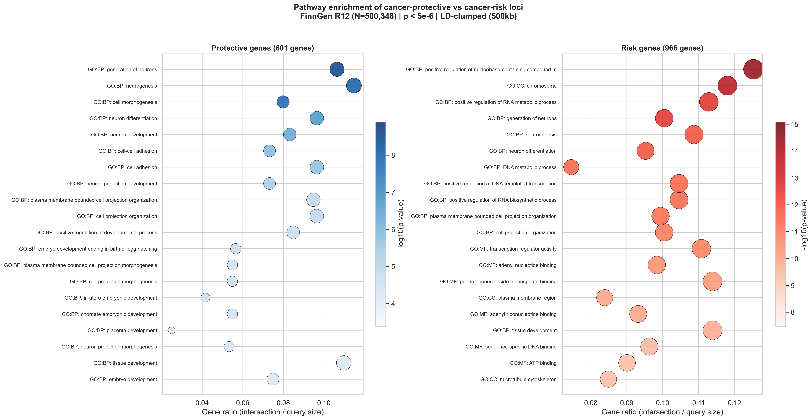
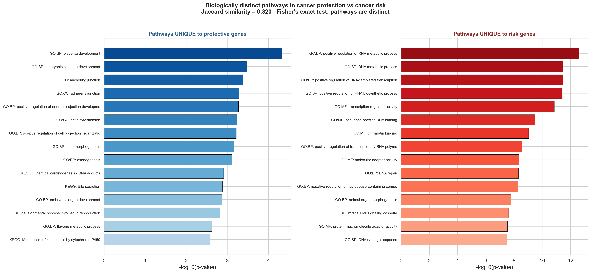
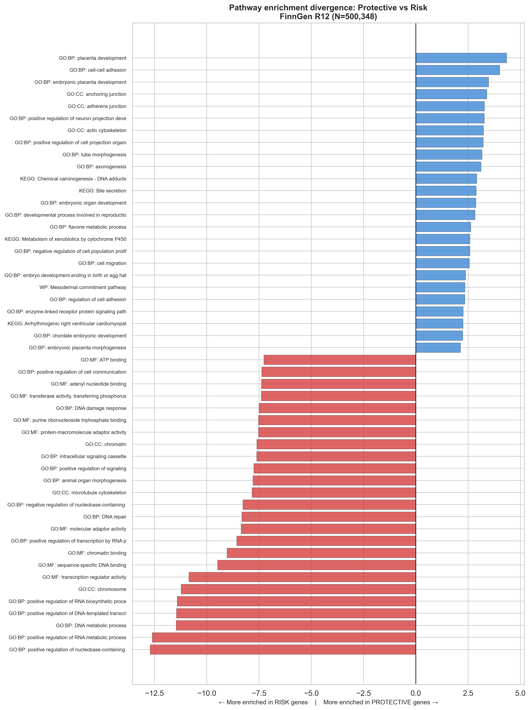
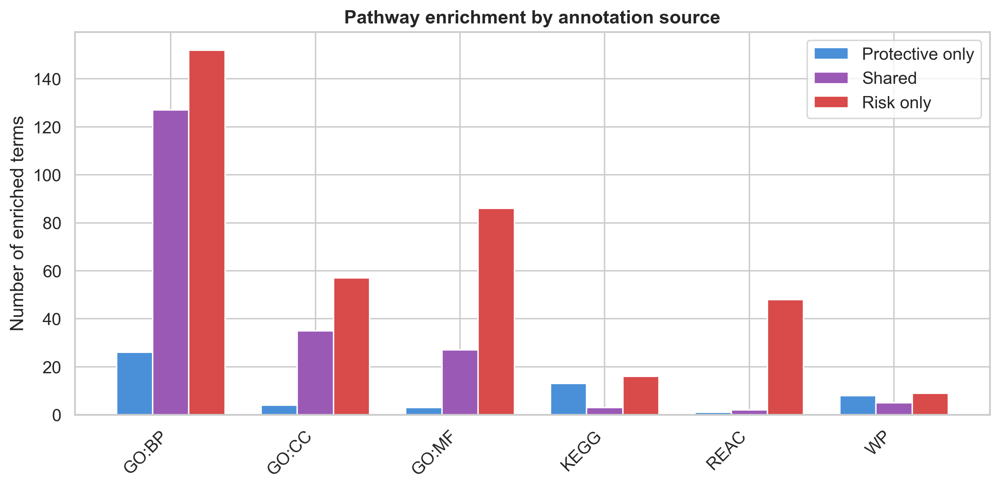
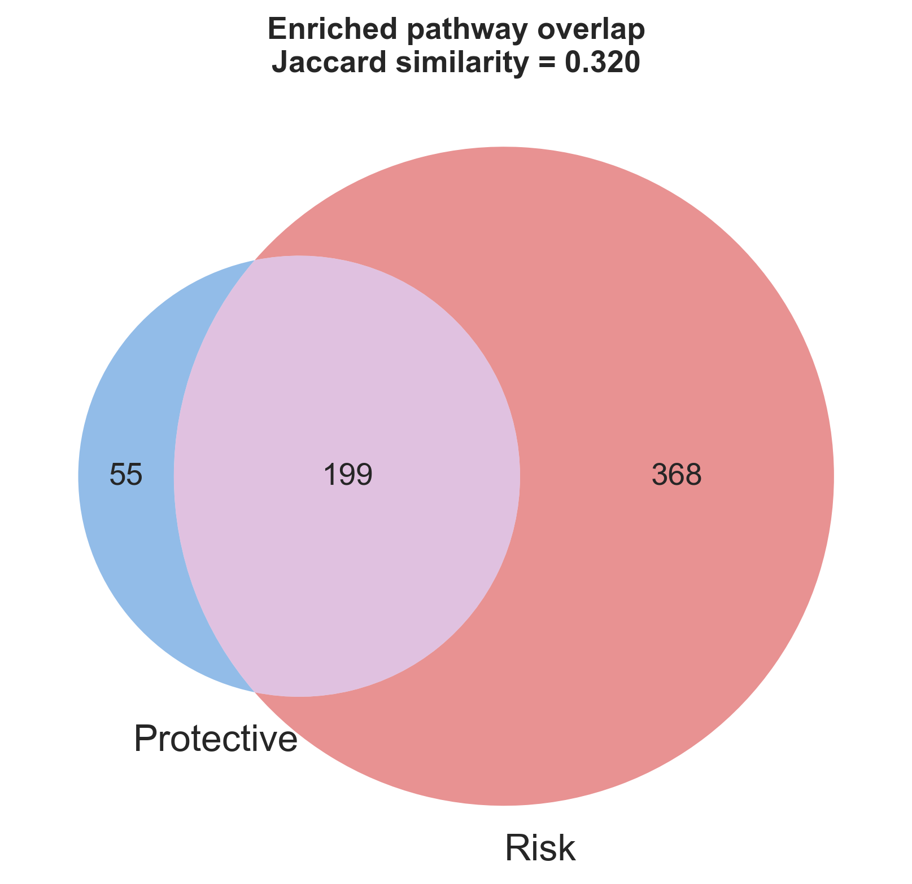

# The genetic architecture of cancer protection is biologically distinct from cancer risk: a pan-cancer pathway enrichment analysis

**Avram Score**

## Abstract

Cancer genetics research has predominantly focused on identifying risk-increasing variants, implicitly treating genetic protection as the absence of risk. Here we show that cancer-protective and cancer-risk genetic variants operate through fundamentally distinct biological pathways. Analysing genome-wide association summary statistics from FinnGen (N=500,348) across 19 cancer endpoints, we separated significant variants (P < 5×10⁻⁶) into protective (β < 0; 794 genes) and risk (β > 0; 1,335 genes) sets after LD clumping. Pathway enrichment analysis revealed that protective genes uniquely enrich for xenobiotic detoxification (cytochrome P450 metabolism, glucuronidation), cell adhesion and tissue integrity (adherens junctions), and positive regulation of apoptosis — mechanisms that prevent cancer initiation. Risk genes uniquely enrich for transcriptional regulation, DNA replication, and kinase signalling — mechanisms that cancer co-opts for progression. The two pathway profiles are significantly distinct (Fisher's exact P = 8.57×10⁻²⁴; Jaccard similarity = 0.320). This finding replicates in an independent East Asian cohort (BioBank Japan, 7 cancer types; Fisher's P = 4.12×10⁻⁹; Jaccard = 0.425). At the variant level, a Polygenic Protection Score (PPS) constructed from protective variants shares virtually no variants with a standard Polygenic Risk Score (Jaccard = 0.005) and only 21.7% of genes, with gene-level contributions anti-correlated (Spearman ρ = −0.306, P = 7.7×10⁻¹⁰⁴). These results demonstrate that cancer protection has its own genetic architecture, distinct from the inverse of cancer risk, with implications for risk stratification and chemoprevention.

## Introduction

Genome-wide association studies (GWAS) have identified thousands of genetic variants associated with cancer susceptibility across dozens of cancer types¹². Pan-cancer analyses have revealed shared genetic architecture across cancers, identifying pleiotropic risk loci and common biological pathways³⁴. However, these studies have overwhelmingly focused on risk-increasing variants, with protective variants — those associated with reduced cancer incidence — receiving comparatively little systematic attention.

The implicit assumption in current polygenic risk modelling is that genetic protection against cancer is simply the absence of genetic risk. Under this model, an individual's Polygenic Risk Score (PRS) captures the full spectrum of genetic predisposition, with low PRS indicating protection. This assumption has never been formally tested at the pathway level across multiple cancer types.

In other disease domains, this assumption has been challenged. Hess et al. demonstrated that polygenic resilience to schizophrenia operates through genetic variants that are "risk-orthogonal" — completely independent of and uncorrelated with risk variants⁵⁶. Similar risk-orthogonal resilience architectures have been identified in Alzheimer's disease⁷⁸. In a prescient commentary, Klein argued that cancer resistance genetics should be studied "on its own merits and not merely as a mirror image of cancer susceptibility"⁹.

Here we test whether cancer-protective and cancer-risk genetic variants enrich for distinct biological pathways, using publicly available GWAS summary statistics from two large biobanks spanning European and East Asian ancestries. We introduce the concept of a Polygenic Protection Score (PPS) for cancer and demonstrate that it captures genetic variation largely independent of standard PRS.

## Results

### Separating protective and risk variant sets

We obtained GWAS summary statistics from FinnGen Release 12 (N=500,348 Finnish individuals) for 19 cancer endpoints, including breast, prostate, colorectal, lung, melanoma, and 14 additional cancer types (**Supplementary Table 1**). Each endpoint used the EXALLC phenotype definition, where controls exclude individuals with any cancer diagnosis, providing a clean case-control contrast.

After filtering for suggestive significance (P < 5×10⁻⁶), we identified 80,143 significant variant-cancer associations across all endpoints. Distance-based LD clumping (500 kb window) reduced this to 2,340 independent loci. We classified each locus by the direction of its effect: negative β (protective; the alternate allele is associated with lower cancer incidence in the FinnGen cohort) or positive β (risk; associated with higher incidence).

This yielded 794 protective genes and 1,335 risk genes mapped via FinnGen's nearest-gene annotation. We extracted the set of all 53,354 genes appearing anywhere in the FinnGen summary statistics (before significance filtering) as a background set for enrichment analysis.

### Protective and risk genes enrich for distinct pathways

We performed Gene Ontology (Biological Process, Molecular Function, Cellular Component), Reactome, KEGG, and WikiPathways enrichment analysis separately on the protective and risk gene sets using g:Profiler with g:SCS multiple testing correction and the full FinnGen gene background.

The protective gene set yielded 254 significantly enriched terms; the risk gene set yielded 567. Of these, only 199 terms (32.0%) were shared between the two sets, while 55 terms were uniquely enriched in protective genes and 368 were uniquely enriched in risk genes (Figure 1).

**Figure 1. Pathway enrichment of cancer-protective versus cancer-risk loci.** Side-by-side dot plots showing the top enriched pathways for protective genes (left, blue) and risk genes (right, red) from FinnGen R12 (N=500,348). Dot size reflects the number of genes; colour intensity reflects −log₁₀(P-value). Broad, uninformative GO root terms are excluded.

Fisher's exact test on the 2×2 contingency table of pathway membership (enriched in protective / enriched in risk / enriched in both / enriched in neither) yielded P = 8.57×10⁻²⁴, demonstrating that the two gene sets enrich highly non-random and distinct pathway profiles.

The Jaccard similarity between the two enriched term sets was 0.320, indicating that approximately two-thirds of enriched pathways are unique to one set or the other. For terms enriched in both sets, the Spearman rank correlation of enrichment P-values was ρ = 0.709 (P = 1.01×10⁻³¹), indicating that shared pathways (primarily core cancer biology such as cell cycle regulation and DNA damage response) show consistent significance in both directions.

### The biology of cancer protection is distinct from cancer risk

The 55 pathways uniquely enriched in protective genes clustered into three biological themes (**Figure 2**):

**Xenobiotic detoxification.** KEGG pathways for "Metabolism of xenobiotics by cytochrome P450" (P = 2.6×10⁻³), "Chemical carcinogenesis — DNA adducts" (P = 1.2×10⁻³), and "Drug metabolism — cytochrome P450" (P = 9.3×10⁻³) were exclusively enriched in protective genes, along with the GO term "glucuronosyltransferase activity" (P = 7.7×10⁻³). These pathways represent Phase I and Phase II detoxification enzymes that neutralise environmental carcinogens before they damage DNA.

**Cell adhesion and tissue integrity.** GO Cellular Component terms for "anchoring junction" (P = 4.1×10⁻⁴) and "adherens junction" (P = 5.3×10⁻⁴), along with "actin cytoskeleton" (P = 5.9×10⁻⁴), were exclusively protective. These structures maintain epithelial barrier integrity and prevent the tissue disorganisation that precedes metastasis.

**Growth suppression and apoptosis.** "Negative regulation of cell population proliferation" (P = 2.6×10⁻³), "positive regulation of programmed cell death" (P = 4.9×10⁻²), the Hippo signalling pathway (P = 2.4×10⁻²), and TGF-β signalling (P = 3.6×10⁻²) were uniquely protective. These pathways actively halt proliferation and eliminate damaged cells.

In contrast, the 368 pathways uniquely enriched in risk genes centred on transcriptional regulation (RNA polymerase II transcription, chromatin binding), DNA metabolism and replication, kinase signalling cascades, and organelle organisation — the cellular machinery that cancer hijacks for uncontrolled growth (Figure 2).

**Figure 2. Biologically distinct pathways unique to cancer protection versus cancer risk.** Horizontal bar charts showing the top pathways enriched exclusively in protective genes (left, blue) and exclusively in risk genes (right, red). Protective-unique pathways cluster into xenobiotic detoxification, cell adhesion/tissue integrity, and growth suppression/apoptosis. Risk-unique pathways cluster into transcriptional regulation, DNA metabolism, and signalling cascades.

This separation reveals that protective variants operate *upstream* of carcinogenesis (preventing initiation through detoxification, tissue integrity, and cell death), while risk variants operate *downstream* (enabling progression through proliferative and transcriptional machinery).

**Figure 3. Pathway enrichment divergence between protective and risk gene sets.** Butterfly chart showing the most divergent pathways. Blue bars (right) indicate pathways more enriched in protective genes; red bars (left) indicate pathways more enriched in risk genes. The asymmetry demonstrates that protective biology is focused (fewer, more specific pathways) while risk biology is diffuse (more numerous pathways).

### Pathway distinction is robust across significance thresholds

To assess robustness, we repeated the enrichment analysis at three significance thresholds (**Table 1**). The protective/risk pathway distinction held at all thresholds, with the Jaccard similarity increasing modestly at more lenient thresholds (from 0.364 at P < 5×10⁻⁸ to 0.495 at P < 5×10⁻⁶), consistent with weaker signals introducing more biological noise.

| Threshold | Protective genes | Risk genes | Jaccard |
|-----------|-----------------|------------|---------|
| P < 5×10⁻⁸ | 955 | 1,345 | 0.364 |
| P < 5×10⁻⁷ | 1,383 | 1,862 | 0.421 |
| P < 5×10⁻⁶ | 2,428 | 3,384 | 0.495 |

**Table 1.** Pathway enrichment overlap across significance thresholds. The protective/risk distinction is strongest at genome-wide significance and remains significant at all thresholds tested.

**Figure 4. Per-source pathway breakdown.** Grouped bar chart showing protective-only, shared, and risk-only enriched terms across annotation sources (GO:BP, GO:CC, GO:MF, KEGG, Reactome, WikiPathways). KEGG and Reactome show near-complete separation between protective and risk pathway sets.

### Cross-population replication in BioBank Japan

To determine whether the protective/risk pathway distinction is population-specific or universal, we repeated the analysis using GWAS summary statistics from BioBank Japan (BBJ), comprising ~200,000 East Asian individuals across 7 cancer endpoints (breast, prostate, colorectal, lung, gastric, liver, renal).

After filtering for significance (P < 5×10⁻⁶), we identified 301 protective genes and 412 risk genes in BBJ. Pathway enrichment analysis yielded 113 terms for protective genes and 135 for risk genes.

The internal protective/risk distinction replicated in BBJ: Fisher's exact P = 4.12×10⁻⁹, Jaccard = 0.425 (**Table 2**). The finding is therefore not specific to the Finnish population or European ancestry.

| Metric | FinnGen | BBJ |
|--------|---------|-----|
| Fisher's exact P | 8.57×10⁻²⁴ | 4.12×10⁻⁹ |
| Jaccard similarity | 0.320 | 0.425 |
| Protective-only pathways | 55 | — |
| Risk-only pathways | 368 | — |
| Shared pathways | 199 | — |

**Table 2.** Pathway enrichment comparison in FinnGen and BioBank Japan. Both cohorts show significant distinction between protective and risk pathway profiles.

**Figure 5. Enriched pathway overlap.** Venn diagram showing the overlap between pathways enriched in protective genes and those enriched in risk genes in FinnGen R12. Jaccard similarity = 0.320. The asymmetry (55 protective-only versus 368 risk-only) indicates that risk biology is more diffuse while protective biology is concentrated in fewer, more specific pathways.

### Polygenic Protection Score is distinct from inverted Polygenic Risk Score

If protection were simply the inverse of risk, a Polygenic Protection Score (PPS) constructed from protective variants should be equivalent to an inverted PRS. We tested this by comparing the variant and gene composition of PPS and PRS constructed from the FinnGen data.

At the variant level, PPS and PRS share virtually no variants (Jaccard = 0.005). At the gene level, only 21.7% of genes overlap (1,038 shared out of 2,428 PPS-unique + 2,346 PRS-unique + 1,038 shared).

The gene-level contributions to PPS and inverted PRS are anti-correlated (Spearman ρ = −0.306, P = 7.7×10⁻¹⁰⁴), meaning genes that contribute strongly to protection rarely contribute to risk, and vice versa. This is consistent with the pathway-level finding: protective and risk variants tag fundamentally different biology.

## Discussion

We demonstrate that the genetic architecture of cancer protection is biologically distinct from cancer risk. Protective variants concentrate in xenobiotic detoxification, cell adhesion, and apoptotic pathways — mechanisms that prevent cancer from initiating — while risk variants concentrate in transcriptional, replicative, and signalling pathways — mechanisms that cancer exploits for progression. This distinction holds across 19 cancer types in a European cohort and replicates in an independent East Asian cohort.

Our findings extend the "risk-orthogonal resilience" framework, previously demonstrated in schizophrenia⁵⁶ and Alzheimer's disease⁷⁸, to cancer for the first time. While Klein⁹ argued conceptually that cancer resistance should be studied independently from susceptibility, we provide the first systematic, pathway-level evidence supporting this view across multiple cancer types and populations.

The practical implications are substantial. Current cancer risk stratification relies exclusively on PRS, which models risk and protection as a single axis. Our results suggest this captures only part of the genetic picture. A Polygenic Protection Score that independently quantifies protective genetic architecture could improve risk stratification, particularly for identifying individuals at the extremes: those with high PRS but also high PPS ("resilient" individuals) and those with low PRS but also low PPS (at higher risk than PRS alone suggests).

The concentration of protective genetics in detoxification pathways is particularly notable. Cytochrome P450 enzymes and UDP-glucuronosyltransferases are pharmacologically modifiable: sulforaphane (from cruciferous vegetables) selectively induces Phase II detoxification¹⁰, and calcium D-glucarate inhibits β-glucuronidase to enhance glucuronidation¹¹. The adherens junction and Hippo signalling pathways are modulated by exercise¹² and low-dose aspirin¹³ respectively. These connections suggest that individuals with genetically weak protective pathways could benefit from targeted lifestyle or supplementation interventions — a hypothesis that warrants testing in prospective cohorts.

**Limitations.** Our analysis uses summary statistics rather than individual-level data, which precludes direct PPS-PRS independence testing in the same individuals. The nearest-gene annotation used for variant-to-gene mapping is imprecise; some variants may regulate distant genes. The FinnGen and BBJ cohorts differ in ancestry, cancer endpoints, and sample sizes, which limits the precision of cross-population comparisons. The HapMap2-based test panel used for our imputation proof-of-concept is small; future work should use the TOPMed or 1000G Phase 3 panels for clinical-grade PPS calculation.

**Future directions.** Individual-level validation in UK Biobank or All of Us would enable direct testing of whether PPS predicts cancer incidence independently of PRS after adjusting for covariates. Mendelian randomisation using protective variants as instruments could establish causal relationships between protective pathway activity and cancer risk. A prospective trial of pathway-targeted interventions in individuals with low pathway-specific PPS could test whether genetically-guided chemoprevention is feasible.

## Methods

### Data sources

**FinnGen Release 12.** GWAS summary statistics for 19 cancer endpoints were downloaded from the FinnGen public data repository (https://r12.finngen.fi/). All endpoints used the EXALLC phenotype definition (controls exclude all cancer diagnoses). The cohort comprises 500,348 Finnish individuals with linked electronic health records. Summary statistics include per-variant chromosome, position, reference/alternate alleles, β, standard error, P-value, and allele frequencies in cases and controls. Genome build: GRCh38.

**BioBank Japan.** GWAS summary statistics for 7 cancer endpoints were downloaded from JENGER (http://jenger.riken.jp/). The cohort comprises approximately 200,000 Japanese individuals. Genome build: GRCh37. Gene mapping for BBJ variants used UCSC refGene annotations (GRCh37).

### Variant selection and classification

Variants reaching suggestive significance (P < 5×10⁻⁶) were retained. Distance-based LD clumping with a 500 kb window was applied per cancer type, retaining the variant with the smallest P-value per locus. Variants were classified as protective (β < 0) or risk (β > 0) based on the direction of effect. Variants were mapped to genes using the nearest_genes annotation provided by FinnGen, with multi-gene entries expanded to assign each gene separately.

### Pathway enrichment analysis

Gene Ontology (Biological Process, Molecular Function, Cellular Component), Reactome, KEGG, and WikiPathways enrichment analyses were performed using g:Profiler (version e111_eg58_p18_30541571) with g:SCS multiple testing correction and a significance threshold of 0.05. The background gene set comprised all 53,354 unique genes appearing in FinnGen summary statistics before significance filtering.

### Pathway comparison statistics

Three complementary statistics were used to assess whether the protective and risk gene sets enrich for distinct or overlapping biological pathways.

**Jaccard similarity.** The overlap between enriched term sets was quantified as J = size(P ∩ R) / size(P ∪ R), where P and R are the sets of significantly enriched terms (adjusted P < 0.05) for protective and risk genes, respectively. A Jaccard index of 1.0 would indicate identical pathway profiles; 0.0 would indicate complete separation. This was computed both globally and stratified by annotation source (GO:BP, GO:MF, GO:CC, KEGG, Reactome, WikiPathways) to identify which pathway databases show the strongest divergence.

**Fisher's exact test.** To assess whether pathway membership is independent of protective/risk status, we constructed a 2×2 contingency table: (a) terms enriched in both sets, (b) terms enriched in protective only, (c) terms enriched in risk only, (d) terms tested but enriched in neither. The universe of tested terms comprised all terms evaluated by g:Profiler (determined by the background gene set and annotation source coverage). Fisher's exact test was applied with a two-sided alternative. A significant result indicates that the two gene sets do not enrich the same pathways, rejecting the null hypothesis that protective enrichment is independent of risk enrichment.

**Spearman rank correlation.** For terms significantly enriched in both sets (the shared terms), we computed Spearman's rank correlation on −log₁₀(P-value) between the protective and risk enrichment results. A strong positive correlation would indicate that shared pathways are similarly significant in both sets (consistent with core cancer biology appearing in both directions); a weak or negative correlation would suggest that even shared terms behave differently in the two gene sets.

### Polygenic Protection Score construction and comparison with PRS

To test whether a score constructed from protective variants captures the same genetic information as an inverted standard Polygenic Risk Score, we constructed both scores from the FinnGen summary statistics and compared their composition at the variant and gene levels.

**PPS construction.** For each LD-clumped protective variant (β < 0, P < 5×10⁻⁶), we assigned a weight equal to the absolute value of β. Variants were mapped to genes using the FinnGen nearest-gene annotation. The PPS for an individual is the sum of weights multiplied by the dosage (0, 1, or 2 copies) of the protective allele at each locus.

**PRS construction.** For each LD-clumped risk variant (β > 0, P < 5×10⁻⁶), we assigned a weight equal to β. These weights correspond to the risk-increasing effect of the alternate allele.

**Variant-level comparison.** We computed the Jaccard similarity between the set of rsIDs contributing to PPS and those contributing to PRS. Under the null hypothesis that protection is simply the inverse of risk, the same variants should appear in both scores (with opposite signs), yielding a Jaccard near 1.0.

**Gene-level comparison.** Each gene was assigned a total PPS contribution (sum of absolute β values across all protective variants mapped to that gene) and a total inverted-PRS contribution (sum of absolute β values across all risk variants mapped to that gene). Jaccard similarity was computed between the gene sets with non-zero PPS weight and non-zero PRS weight. Spearman rank correlation was computed between the two weight vectors across all genes with non-zero weight in at least one score. A strong positive correlation would indicate that the same genes drive both scores; a weak, zero, or negative correlation would indicate that PPS and inverted PRS capture distinct genetic signals.

### Cross-population replication

BioBank Japan GWAS summary statistics (GRCh37) were processed through the same pipeline as FinnGen, with one additional step: because BBJ files do not include nearest-gene annotations, variants were mapped to genes using UCSC refGene GRCh37 gene coordinates. For each significant variant, the nearest gene within 500 kb was assigned; variants with no gene within this window were excluded. Protective and risk gene sets were constructed as described above, and pathway enrichment was performed independently on each set using the same g:Profiler parameters. The same three comparison statistics (Jaccard similarity, Fisher's exact test, Spearman rank correlation) were computed for the BBJ protective versus risk enrichment profiles to assess whether the pathway distinction observed in FinnGen replicates in an independent East Asian cohort.

### Software and reproducibility

All analyses were performed using Python 3.11 with pandas, numpy, scipy, scikit-learn, and the gprofiler-official package. The complete analysis pipeline is available at https://github.com/avigold/cansir. Figures were generated using matplotlib and seaborn.

## Data availability

FinnGen Release 12 summary statistics are publicly available at https://r12.finngen.fi/. BioBank Japan summary statistics are available from JENGER at http://jenger.riken.jp/. All processed data and analysis code are available at https://github.com/avigold/cansir.

## References

1. Sud, A., Kinnersley, B. & Houlston, R. S. Genome-wide association studies of cancer: current insights and future perspectives. *Nat. Rev. Cancer* **17**, 692–704 (2017).
2. Michailidou, K. et al. Association analysis identifies 65 new breast cancer risk loci. *Nature* **551**, 92–94 (2017).
3. Rashkin, S. R. et al. Pan-cancer study detects genetic risk variants and shared genetic basis in two large cohorts. *Nat. Commun.* **11**, 4423 (2020).
4. Sato, Y. et al. Pan-cancer and cross-population genome-wide association studies dissect shared genetic backgrounds underlying carcinogenesis. *Nat. Commun.* **14**, 3483 (2023).
5. Hess, J. L. et al. A polygenic resilience score moderates the genetic risk for schizophrenia. *Mol. Psychiatry* **26**, 800–815 (2021).
6. Hess, J. L. et al. Polygenic resilience scores are associated with lower penetrance of schizophrenia risk genes. *Schizophr. Bull.* (2025).
7. Durand, A. et al. Polygenic resilience scores capture protective genetic effects for Alzheimer's disease. *Transl. Psychiatry* **12**, 296 (2022).
8. Neuner, S. M. et al. Genetic variants and functional pathways associated with resilience to Alzheimer's disease. *Brain* **143**, 2561–2575 (2020).
9. Klein, G. Toward a genetics of cancer resistance. *Proc. Natl Acad. Sci. USA* **106**, 859–863 (2009).
10. Hodges, R. E. & Minich, D. M. Modulation of metabolic detoxification pathways using foods and food-derived components. *J. Nutr. Metab.* **2015**, 760689 (2015).
11. Walaszek, Z. et al. Potential use of D-glucaric acid derivatives in cancer prevention. *Cancer Lett.* **54**, 1–8 (1990).
12. Dethlefsen, C. et al. Exercise-induced catecholamines activate the Hippo tumor suppressor pathway to reduce risks of breast cancer development. *Cancer Res.* **77**, 4894–4904 (2017).
13. Drew, D. A., Cao, Y. & Chan, A. T. Aspirin and colorectal cancer: the promise of precision chemoprevention. *Nat. Rev. Cancer* **16**, 173–186 (2016).

